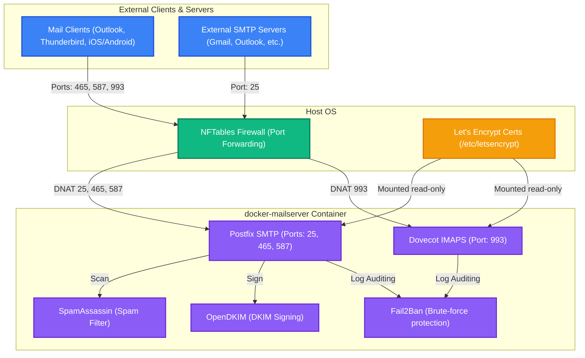

# 📧 Docker eMailServer Stack

[EN](README.md) | [UA](README.ua.md)

This repository contains the configuration, scripts, and deployment files for running a secure, hardened, and modernized mail server based on [docker-mailserver](https://github.com/docker-mailserver/docker-mailserver) on the host.

---

## 📐 Architecture Overview

Below is the layout of the mail server stack and its interactions:



---

## 🏗️ Project Structure

- **[docker-compose.yml](file:///root/geminicli/projects/mail-server/docker-compose.yml)**: DMS service definitions with integrated Autoconfig, Postfix Exporter, and Rspamd dashboard port exposure.
- **[mailserver.env](file:///root/geminicli/projects/mail-server/mailserver.env)**: Environment variables tuning security parameters (enables Rspamd, TLS modern, disables SpamAssassin).
- **[setup-accounts.sh](file:///root/geminicli/projects/mail-server/setup-accounts.sh)**: Automates mailbox creation, accounts config, and DKIM generation.
- **[backup-mail.sh](file:///root/geminicli/projects/mail-server/backup-mail.sh)**: Automated backups helper script using Restic.
- **[install.sh](file:///root/geminicli/projects/mail-server/install.sh)**: Single-command installer script.

---

## ⚡ Quick Start (One-Command Installation)

You can clone, configure directories, and deploy the entire mail stack with a single command:

**Using curl:**
```bash
curl -sSL https://raw.githubusercontent.com/weby-homelab/docker-eMailServer/main/install.sh | bash
```

**Using wget:**
```bash
wget -qO- https://raw.githubusercontent.com/weby-homelab/docker-eMailServer/main/install.sh | bash
```

---

## 📊 Dashboards & Metrics Access

### 1. Rspamd Web UI Dashboard (Spam & DKIM graphs)
Rspamd runs a built-in admin web panel. For security, it binds only to `127.0.0.1:11334`.

#### How to configure the password:
1. Generate a hashed password inside the container:
   ```bash
   docker exec -it mailserver rspamadm pw
   ```
2. Create directory and paste the hash into configuration:
   ```bash
   mkdir -p ./docker-data/config/rspamd/override.d/
   cat <<EOF > ./docker-data/config/rspamd/override.d/worker-controller.inc
   bind_socket = "0.0.0.0:11334";
   password = "\$2\$your_generated_hash_here";
   EOF
   ```
3. Restart Rspamd service:
   ```bash
   docker compose restart mailserver
   ```

#### How to access:
Access it securely by setting up an SSH tunnel:
```bash
ssh -N -L 11334:127.0.0.1:11334 user@your-server-ip
```
Then open **`http://localhost:11334`** in your browser.

---

### 2. Prometheus & Grafana (Mail flow metrics)
The mail server exposes Prometheus metrics via `postfix-exporter` on port `9154` (localhost).

- **Scrape endpoint**: `http://127.0.0.1:9154/metrics`
- **Grafana Dashboard**: You can use the popular [Postfix Prometheus Dashboard (ID: 10013)](https://grafana.com/grafana/dashboards/10013-postfix/) to visualize traffic volumes, bounces, delays, and filter statuses in real-time.

---

## 🔒 Hardening & Security Features

The mail server runs with maximum security configurations out-of-the-box:
1. **Modern TLS**: `TLS_LEVEL=modern` forces TLS 1.3 or high-grade TLS 1.2 secure ciphers.
2. **Brute-force Protection**: **Fail2Ban** is enabled (`ENABLE_FAIL2BAN=1`) to monitor log files and block malicious IPs dynamically.
3. **Spam Filtering**: **Rspamd** is enabled (`ENABLE_RSPAMD=1`) as a modern and fast replacement for SpamAssassin.
4. **SSL/TLS Certificates**: Mounted directly from Let's Encrypt (`/etc/letsencrypt`) on the host.
5. **Secure Ports Only**:
   - `25`: SMTP (Server-to-Server transfer)
   - `465`: SMTPS (Secure SMTP over SSL/TLS)
   - `587`: Submission (SMTP with authentication)
   - `993`: IMAPS (IMAP over SSL/TLS)
   - **Port 143 (unencrypted IMAP) is disabled** to prevent insecure connection attempts.

---

## 📜 License

This project is licensed under the **GNU GPLv3 License**. See [LICENSE](file:///root/geminicli/projects/mail-server/LICENSE) for details.
