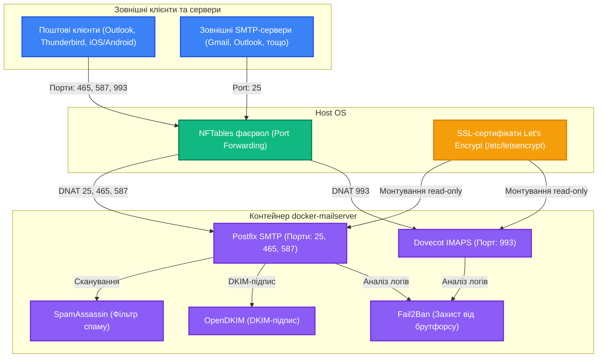

# 📧 Docker eMailServer Stack

[EN](README.md) | [UA](README.ua.md)

Цей репозиторій містить конфігурацію, скрипти та файли розгортання для запуску безпечного, захищеного та модернізованого поштового сервера на базі [docker-mailserver](https://github.com/docker-mailserver/docker-mailserver) на хост-системі.

---

## 📐 Огляд архітектури

Нижче наведено схему роботи поштового стеку та його взаємодії з клієнтами:



---

## 🏗️ Структура проекту

- **[docker-compose.yml](file:///root/geminicli/projects/mail-server/docker-compose.yml)**: Опис Docker-сервісів із вбудованими контейнерами Autoconfig, Postfix Exporter та прокиданням порту Rspamd.
- **[mailserver.env](file:///root/geminicli/projects/mail-server/mailserver.env)**: Змінні середовища для налаштування безпеки (TLS, включено Rspamd, вимкнено SpamAssassin).
- **[setup-accounts.sh](file:///root/geminicli/projects/mail-server/setup-accounts.sh)**: Скрипт автоматичного створення поштових скриньок та генерації DKIM-ключів.
- **[backup-mail.sh](file:///root/geminicli/projects/mail-server/backup-mail.sh)**: Допоміжний скрипт автоматичного резервного копіювання за допомогою Restic.
- **[install.sh](file:///root/geminicli/projects/mail-server/install.sh)**: Скрипт автоматичного встановлення та запуску стеку.

---

## ⚡ Швидкий запуск (Встановлення однією командою)

Ви можете клонувати репозиторій, створити необхідні директорії та запустити весь поштовий стек однією командою:

**Через curl:**
```bash
curl -sSL https://raw.githubusercontent.com/weby-homelab/docker-eMailServer/main/install.sh | bash
```

**Через wget:**
```bash
wget -qO- https://raw.githubusercontent.com/weby-homelab/docker-eMailServer/main/install.sh | bash
```

---

## 📊 Доступ до дашбордів та графіків

### 1. Веб-панель Rspamd (Графіки спаму, оцінок та DKIM)
Контейнер містить вбудовану веб-панель Rspamd. З міркувань безпеки порт панелі `11334` прокинутий лише на локальний інтерфейс `127.0.0.1`.

#### Як налаштувати пароль доступу:
1. Згенеруйте хеш пароля всередині запущеного контейнера:
   ```bash
   docker exec -it mailserver rspamadm pw
   ```
2. Створіть директорію конфігів та запишіть туди отриманий хеш:
   ```bash
   mkdir -p ./docker-data/config/rspamd/override.d/
   cat <<EOF > ./docker-data/config/rspamd/override.d/worker-controller.inc
   bind_socket = "0.0.0.0:11334";
   password = "\$2\$your_generated_hash_here";
   EOF
   ```
3. Перезапустіть поштовий сервер для застосування конфігурації:
   ```bash
   docker compose restart mailserver
   ```

#### Як підключитися:
Створіть безпечний SSH-тунель з вашого локального ПК до сервера:
```bash
ssh -N -L 11334:127.0.0.1:11334 user@your-server-ip
```
Після цього відкрийте у браузері адресу **`http://localhost:11334`** та введіть свій звичайний пароль.

---

### 2. Prometheus & Grafana (Метрики черги та обсягів пошти)
Служба `postfix-exporter` збирає метрики з логів пошти та віддає їх на локальному порту `9154`.

- **Шлях збору (Scrape endpoint)**: `http://127.0.0.1:9154/metrics`
- **Дашборд для Grafana**: Ви можете використовувати популярний шаблон [Postfix Prometheus Dashboard (ID: 10013)](https://grafana.com/grafana/dashboards/10013-postfix/) для візуалізації в реальному часі графіків навантаження, черги листів, відхилених та надісланих повідомлень.

---

## 🔒 Особливості безпеки та харденінгу

Поштовий сервер працює з максимальними налаштуваннями безпеки "з коробки":
1. **Modern TLS**: Параметр `TLS_LEVEL=modern` дозволяє використання лише протоколів TLS 1.3 або стійких шифрів TLS 1.2.
2. **Захист від брутфорсу**: Включено **Fail2Ban** (`ENABLE_FAIL2BAN=1`) для динамічного блокування IP-адрес зловмисників.
3. **Фільтрація спаму**: Працює сучасний та швидкий фільтр **Rspamd** (`ENABLE_RSPAMD=1`) як заміна SpamAssassin.
4. **SSL/TLS сертифікати**: Монтуються безпосередньо з Let's Encrypt (`/etc/letsencrypt`) хост-системи.
5. **Тільки безпечні порти**:
   - `25`: SMTP (пересилання між серверами)
   - `465`: SMTPS (SMTP поверх SSL/TLS)
   - `587`: Submission (SMTP з авторизацією)
   - `993`: IMAPS (IMAP поверх SSL/TLS)
   - **Порт 143 (unencrypted IMAP) повністю вимкнено** з метою підвищення безпеки.

---

## 📜 Ліцензія

Цей проект поширюється на умовах ліцензії **GNU GPLv3**. Детальніше див. у файлі [LICENSE](file:///root/geminicli/projects/mail-server/LICENSE).
